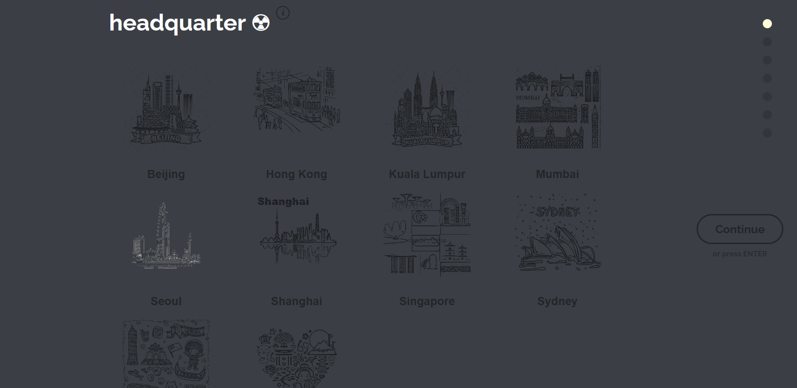

# Internal Project Ideation Platform

## 📌 Project Overview
An interactive, multi-stage web application designed for employees to submit and track project innovations. The platform features a dynamic state-driven UI that ensures data integrity through every step of the submission lifecycle.

## 🔄 User Submission Flow

### 1. Office Selection
Users begin by selecting their global office location from an interactive icon grid (Sydney, Hong Kong, London, etc.). The "Continue" button is programmatically enabled only after a valid selection is detected.

### 2. Identity & Autocomplete
Users input their name. To optimize user experience and data accuracy, I implemented **Autocomplete/Typeahead** logic that suggests employee names from the internal directory as the user types.

### 3. Team Classification
A dynamic dropdown menu allows users to categorize their project by team. This step ensures the idea is routed to the correct department for review.

### 4. Project Specification (Idea Description)
Users provide a detailed description of their innovation. The text area includes character-count validation to ensure descriptions are concise yet informative.

### 5. Lifecycle Status
Users define the current state of their idea (e.g., Initial Concept, Prototype, or Submitted). This metadata is critical for tracking the project's maturity within the innovation pipeline.

### 6. Review & Final Submission
Before finalization, users are presented with a comprehensive **Review Page**. This allows for a final audit of all entered data (Team, Office, Description) before the record is committed to the database.

## 🛠 Technical Achievements
* **Dynamic State Management:** Developed a custom workflow controller that manages transitions between form steps based on input validation.
* **Responsive UX:** Utilized CSS flexbox and grid to maintain a consistent interactive experience across different screen resolutions.
* **Data Integrity:** Engineered a final review state to reduce submission errors and improve the quality of stored internal data.

---
*Developed by Minh Giang Le*
